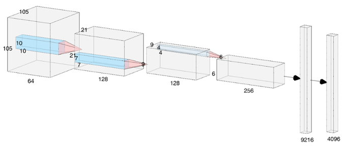
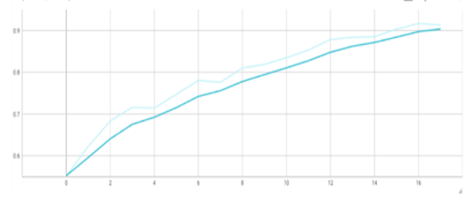
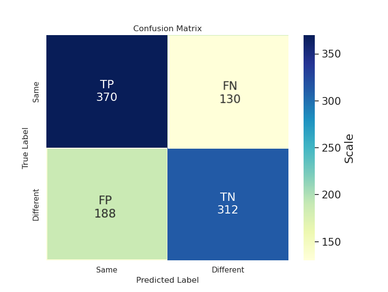
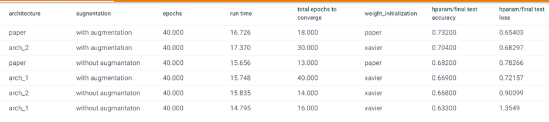

# Implemnting Siamese Network using pytorch

In this code i implmented three diffrent CNN models that differ between human faces, giving an answer if its the same person or not.

## Data Processing:
I used the LFW2 dataset of grayscale images of diffrent celebreties.
the images were resized and normalized to fit the model. 

## The model:
All models has a general structure of CNN layers followed by Fully connected layers for flatenning and classification.
The models differ by fliters sizes, stirdes,padding,activation functions,ways if intializtions etc.

## Training the model:
All models were trained either with or without augmentation to see the augmention effect on the test accuracy
on 2,200 samples: half of the class "same" and half on the class "diffrent".
L2 regulariztion and early stoping criteria  were applied. 

## Model Preformence and Results :
**Model accuracy during training:**

**Best Model Confusion Matrix on The test set:**

**A Summary of all models preformance with or without augmentation:**

